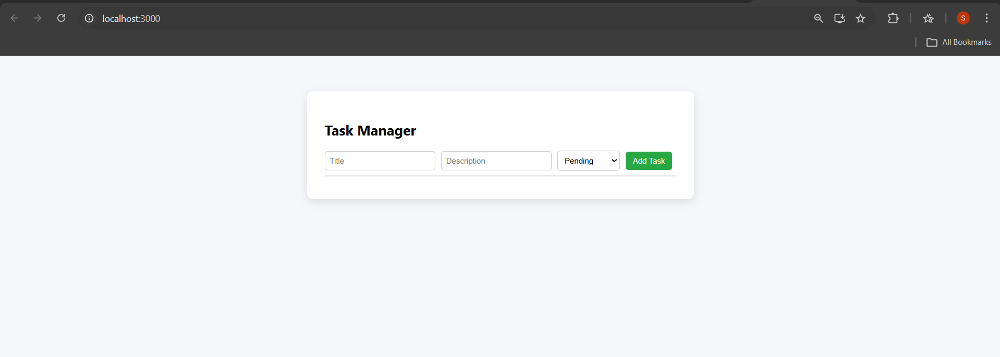
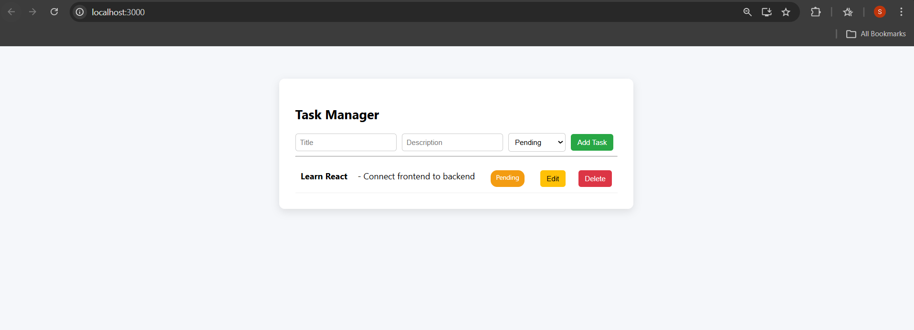
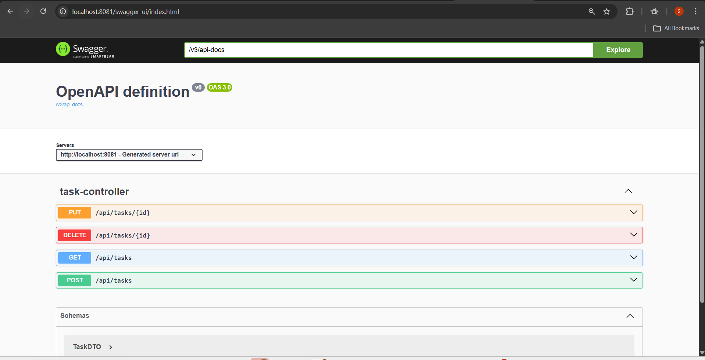
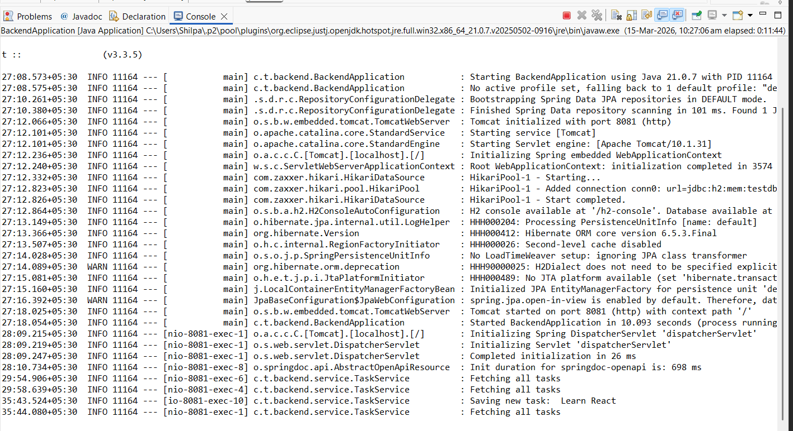

# 📝 Task Manager Fullstack Application

A **Full Stack Task Manager Application** built using **Spring Boot** for the backend and **React.js** for the frontend.
The application allows users to **create, update, delete, and manage tasks** with a clean UI and RESTful API integration.

---

# 🚀 Features

* Create new tasks
* Update existing tasks
* Delete tasks
* View all tasks
* Task status management (Pending / Completed)
* RESTful API with Spring Boot
* Swagger API documentation
* Responsive React UI
* Full CRUD operations

---

# 🛠 Tech Stack

## Frontend

* React.js
* Axios
* CSS

## Backend

* Spring Boot
* Spring Data JPA
* H2 Database
* Maven
* Swagger (OpenAPI)

---

# 📂 Project Structure

```
task-manager-fullstack
│
├── backend
│   └── Spring Boot Application
│
├── frontend
│   └── React Application
│
├── backend-running.png
├── swagger-api.png
├── task-actions.png
├── task-added.png
├── task-manager-ui.png
│
└── README.md
```

---

# 📸 Application Screenshots

## Task Manager UI



---

## Add Task Example


---

## Edit & Delete Task



---

## Swagger API Documentation



---

## Backend Running in Eclipse



---

# ▶ Running the Project

## 1️⃣ Run Backend (Spring Boot)

Navigate to backend folder:

```
cd backend
```

Run the application:

```
mvn spring-boot:run
```

Backend runs on:

```
http://localhost:8081
```

Swagger API:

```
http://localhost:8081/swagger-ui/index.html
```

---

## 2️⃣ Run Frontend (React)

Navigate to frontend folder:

```
cd frontend
```

Install dependencies:

```
npm install
```

Start the application:

```
npm start
```

Frontend runs on:

```
http://localhost:3000
```

---

# 📌 REST API Endpoints

| Method | Endpoint          | Description       |
| ------ | ----------------- | ----------------- |
| GET    | `/api/tasks`      | Fetch all tasks   |
| POST   | `/api/tasks`      | Create a new task |
| PUT    | `/api/tasks/{id}` | Update a task     |
| DELETE | `/api/tasks/{id}` | Delete a task     |

---

# 🗄 Database

The application uses **H2 in-memory database** for simplicity.

H2 Console:

```
http://localhost:8081/h2-console
```

---

# 👩‍💻 Author

**Shilpa Malladi**

GitHub:
https://github.com/ShilpaAM2231

---

# ⭐ Future Improvements

* User authentication (JWT)
* Task priority
* Task due dates
* Deploy application to cloud (AWS / Render)
* Pagination & filtering
